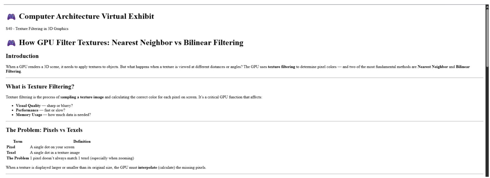
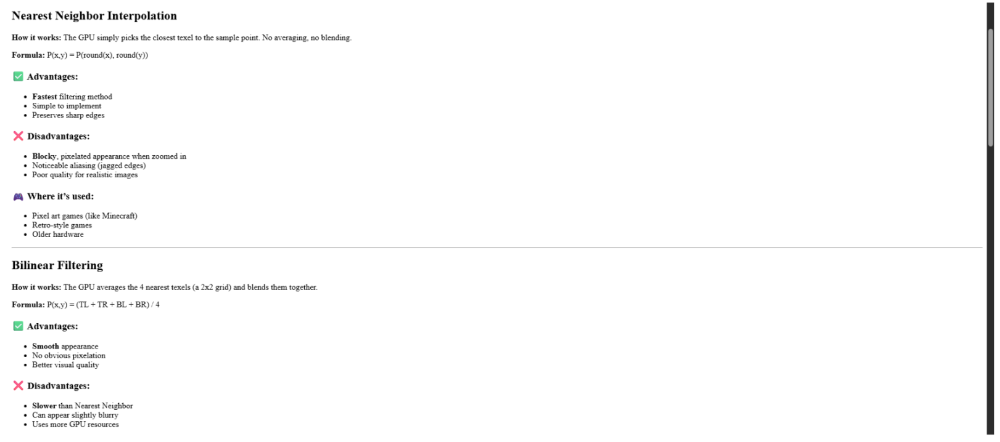
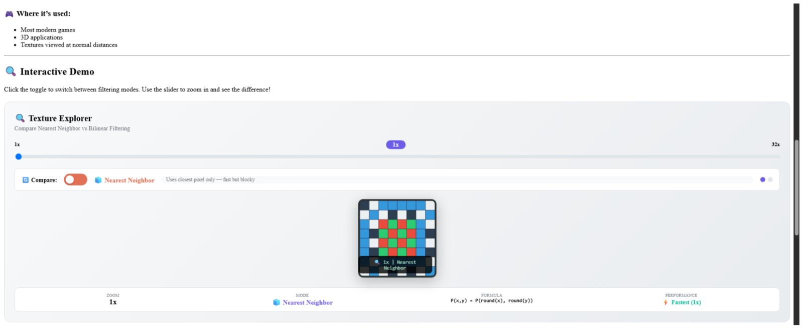
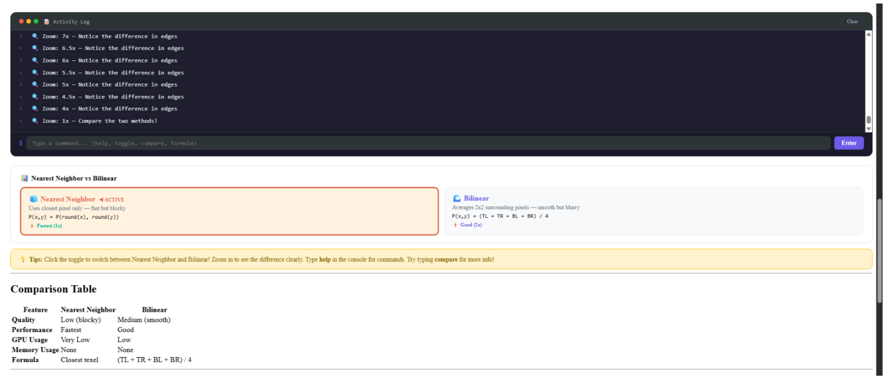
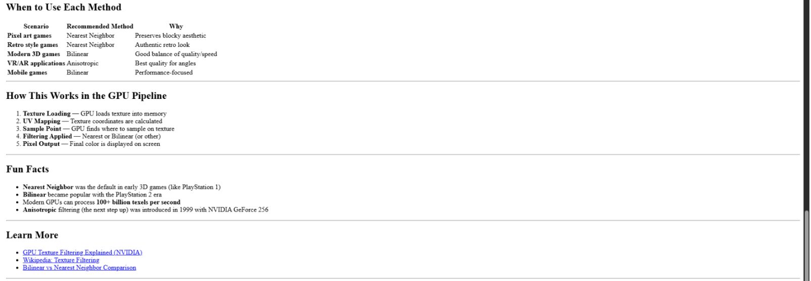
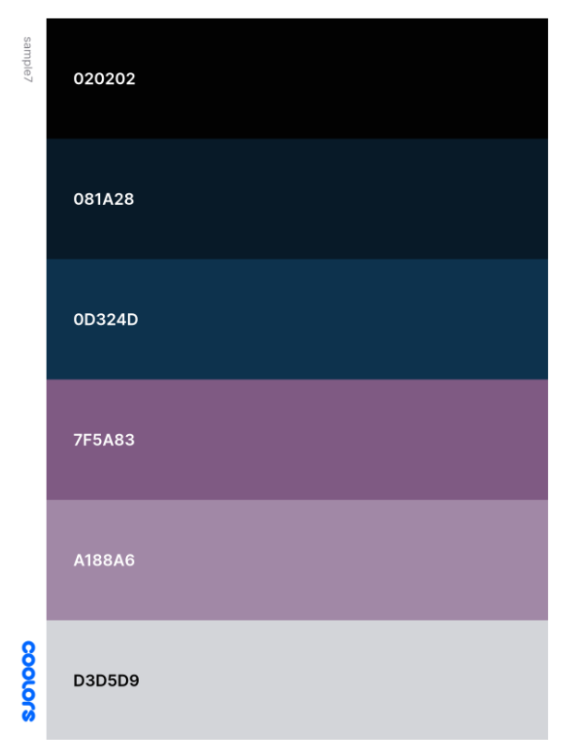
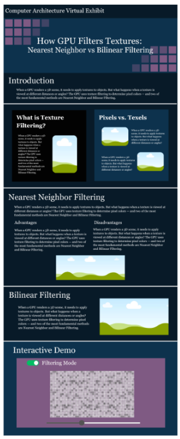

# How GPU Texture Filters Work: Nearest Neighbor Interpolation vs. Bilinear Filtering

**Group 7 Members:**
* Arugay, Enrico Joaquin C.
* Cailao, Carlos Luis B.
* Felix, Catherine Liberty B.
* Gamboa, Raphael R.
* Gutierrez, Michael Luis J.

**Course Section:** CSARCH2-S40  
**Date of Submission:** 06/17/2026

---

## I. Chosen Topic
* **Category:** How It Works
* **Theme:** GPU Texture Filtering
* **Title:** How GPU Filter Textures Work: Nearest Neighbor Interpolation vs. Bilinear Filtering

### Introduction
When a coordinate does not lie on texel centers, where defined color values lie, the Graphics Processing Unit (GPU) must find a color for that coordinate. This could happen when 2D textures are stretched over 3D objects. To find that color, the GPU uses texture filtering. 

This Virtual Exhibit demonstrates how the Texture Mapping Unit (TMU), a GPU hardware, calculates for the closest texels and fetches the colors of those texels from the GPU's L1 Cache all the way down to the Video RAM (VRAM). To present this process, the group will be focusing on two fundamental filtering techniques, Nearest Neighbor Filtering and Bilinear Filtering.

## II. Technical Overviews

### A. Key Hardware Components
1. **Arithmetic Logic Units**
   * Processing units in the GPU used primarily for processing visuals and executing related calculations
2. **Texture Mapping Unit (TMU)**
   * Found in the GPU
   * This is the unit responsible for sampling textures and filtering
   * In the process of filtering, it fetches texels and outputs the filtered color value
3. **L1 Cache**
   * Local high-speed cache located in each compute unit
   * Designed with a 2D layout in consideration of the spatial layout of textures
4. **L2 Cache**
   * Shared GPU cache
5. **Video RAM (VRAM)**
   * Built-in GPU memory
   * Much faster than RAM
   * Holds raw texture data (texels)

---

### B. Nearest Neighbor Interpolation
1. The simplest and fastest method, albeit rarely used
   * The TMU receives a texture coordinate (u, v)
   * It then calculates the coordinates of the texel closest to the received sample point using rounding
   * It takes the color of the single closest pixel and returns that exact texel
2. Inefficient since it could lead to grainy or blocky results

### C. Bilinear Filtering
1. More accurate and more common than nearest neighbor filtering (implemented in modern graphics hardware)
   * The TMU simultaneously finds the 4 closest texels to the sample point
   * Blends these 4 texels, resulting in a custom color
2. Might result in blurry or muddy textures

---

## III. Detailed Plan

### A. Tech Stack
1. **Runtime Environment:** Node.js
2. **Core Framework:** Astro 6
3. **Component Architecture:** React 19 & MDX
4. **Styling Framework:** Tailwind CSS

### B. Interactive Elements
1. **Magnifier Slider**
   * A dynamic slider that allows users to adjust magnification factor scaling from 1x to 32x. The step increment of the coordinate sampler array will be shown in real-time.
2. **Live Console**
   * A display box alongside the canvas that shows the exact calculations happening behind the scenes.
3. **Toggle**
   * A switch that changes the sampling function between Nearest Neighbor and Bilinear.

---

## IV. Style Guide

### 1. Sample Layout

### 2. Palette

* **Primary Background:** `#020202`
* **Secondary Background:** `#081a28`
* **Accent Colors:** `#0d324d`, `#7f5a83`, `#a188a6`
* **Font Color:** `#d3d5d9`

### 3. Typography
* **Headings:** Georgia, serif
* **Body:** Georgia, serif
* **Console:** Courier New, monospace
* **Interactive Labels:** System-UI stack
* **Footer:** System-UI stack

---

## V. Target Repository Structure

csarch2-case-project
├── astro.config.mjs
├── package.json
├── tsconfig.json
└── src/
    ├── components/
    │   └── TextureSimulator.jsx     # Houses unified state logic & LERP math blocks
    ├── data/
    │   └── exhibit-info.json        # Contains team index, title metadata, and category parameters
    ├── layouts/
    │   └── ExhibitLayout.astro      # Frame layout injector containing layout templates
    ├── pages/
    │   └── index.mdx                # Main exhibit content / simulator component
    └── styles/
        └── global.css               # System directives for Tailwind utility injection

## References

* Documentation - Texture filtering. (n.d.). Arm Developer. https://developer.arm.com/documentation/102449/0200/Texture-filtering
* Stevewhims. (n.d.-a). Bilinear texture filtering - UWP applications. Microsoft Learn. https://learn.microsoft.com/en-us/windows/uwp/graphics-concepts/bilinear-texture-filtering
* Stevewhims. (n.d.-a). Nearest-point sampling - UWP applications. Microsoft Learn. https://learn.microsoft.com/en-us/windows/uwp/graphics-concepts/nearest-point-sampling
* Stevewhims. (n.d.). Texture filtering - UWP applications. Microsoft Learn. https://learn.microsoft.com/en-us/windows/uwp/graphics-concepts/texture-filtering
* Wikipedia contributors. (2026, March 4). Texture filtering. Wikipedia. https://en.wikipedia.org/wiki/Texture_filtering