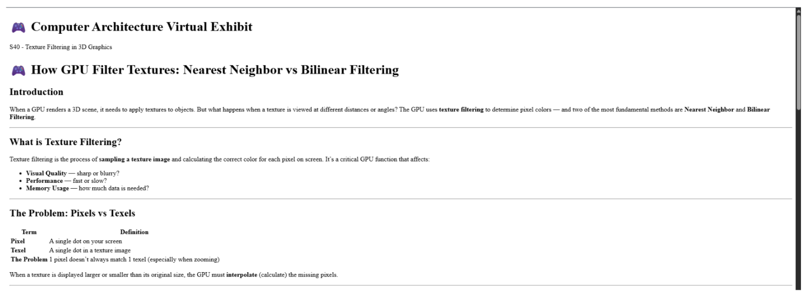
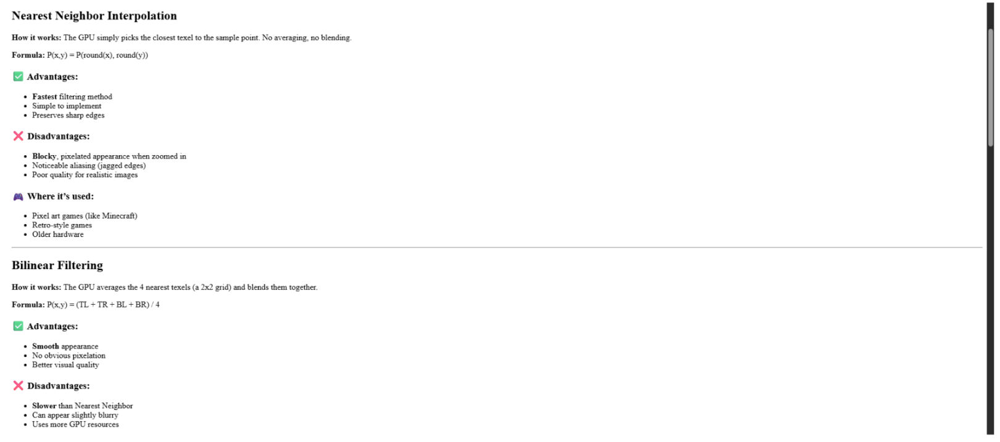
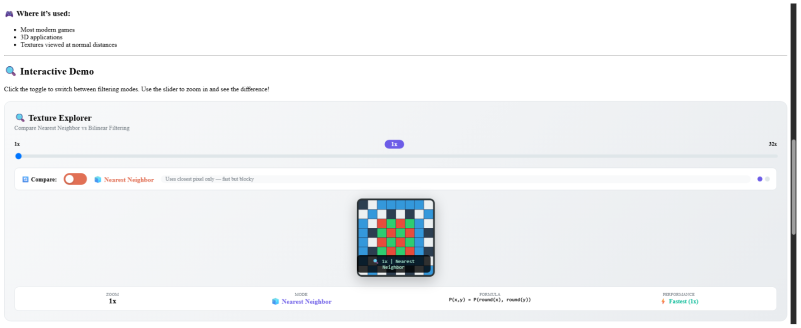
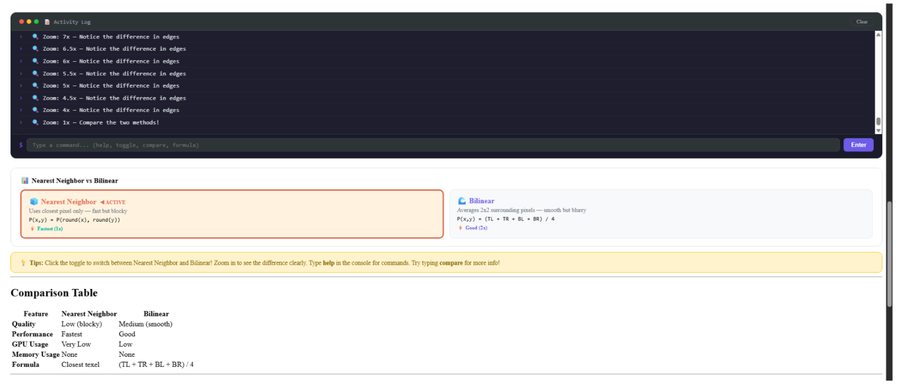
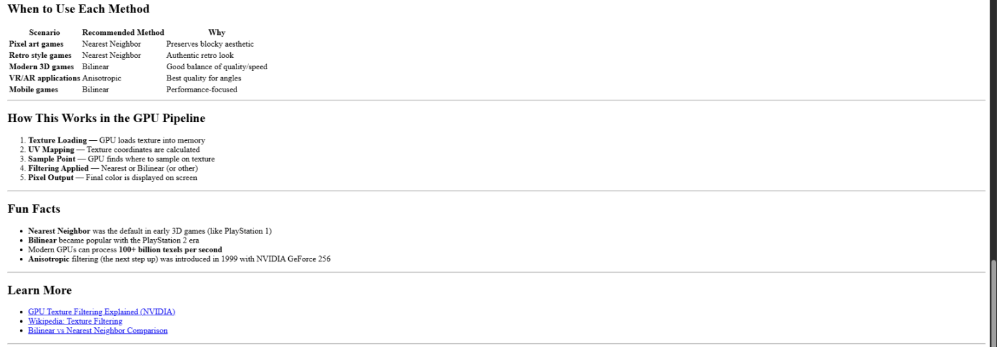
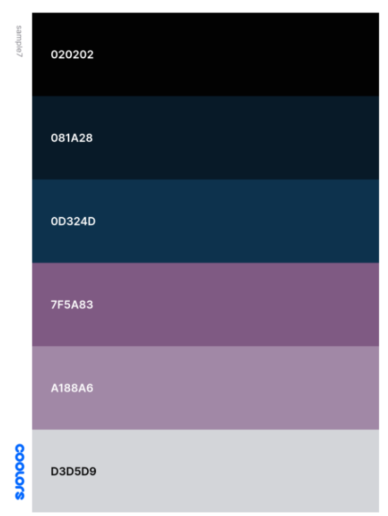
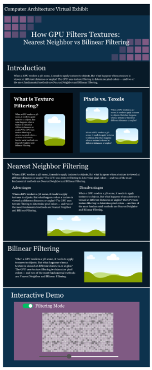

# How GPU Texture Filters Work: Nearest Neighbor Interpolation vs. Bilinear Filtering

**Group 7 Members:**
* Arugay, Enrico Joaquin C.
* Cailao, Carlos Luis B.
* Felix, Catherine Liberty B.
* Gamboa, Raphael R.
* Gutierrez, Michael Luis J.

**Course Section:** CSARCH2-S40  
**Date of Submission:** 06/17/2026

---

## I. Chosen Topic
* **Category:** How It Works
* **Theme:** GPU Texture Filtering
* **Title:** How GPU Filter Textures Work: Nearest Neighbor Interpolation vs. Bilinear Filtering

### Introduction
When a coordinate does not lie on texel centers, where defined color values lie, the Graphics Processing Unit (GPU) must find a color for that coordinate. This could happen when 2D textures are stretched over 3D objects. To find that color, the GPU uses texture filtering. 

This Virtual Exhibit demonstrates how the Texture Mapping Unit (TMU), a GPU hardware, calculates for the closest texels and fetches the colors of those texels from the GPU's L1 Cache all the way down to the Video RAM (VRAM). To present this process, the group will be focusing on two fundamental filtering techniques, Nearest Neighbor Filtering and Bilinear Filtering.

## II. Technical Overviews

### A. Key Hardware Components
1. **Arithmetic Logic Units**
   * Processing units in the GPU used primarily for processing visuals and executing related calculations
2. **Texture Mapping Unit (TMU)**
   * Found in the GPU
   * This is the unit responsible for sampling textures and filtering
   * In the process of filtering, it fetches texels and outputs the filtered color value
3. **L1 Cache**
   * Local high-speed cache located in each compute unit
   * Designed with a 2D layout in consideration of the spatial layout of textures
4. **L2 Cache**
   * Shared GPU cache
5. **Video RAM (VRAM)**
   * Built-in GPU memory
   * Much faster than RAM
   * Holds raw texture data (texels)

---

### B. Nearest Neighbor Interpolation
1. The simplest and fastest method, albeit rarely used
   * The TMU receives a texture coordinate (u, v)
   * It then calculates the coordinates of the texel closest to the received sample point using rounding
   * It takes the color of the single closest pixel and returns that exact texel
2. Inefficient since it could lead to grainy or blocky results

### C. Bilinear Filtering
1. More accurate and more common than nearest neighbor filtering (implemented in modern graphics hardware)
   * The TMU simultaneously finds the 4 closest texels to the sample point
   * Blends these 4 texels, resulting in a custom color
2. Might result in blurry or muddy textures

---

## III. Detailed Plan

### A. Tech Stack
1. **Runtime Environment:** Node.js
2. **Core Framework:** Astro 6
3. **Component Architecture:** React 19 & MDX
4. **Styling Framework:** Tailwind CSS

### B. Interactive Elements
1. **Magnifier Slider**
   * A dynamic slider that allows users to adjust magnification factor scaling from 1x to 32x. The step increment of the coordinate sampler array will be shown in real-time.
2. **Live Console**
   * A display box alongside the canvas that shows the exact calculations happening behind the scenes.
3. **Toggle**
   * A switch that changes the sampling function between Nearest Neighbor and Bilinear.

---

## IV. Style Guide

### 1. Sample Layout





### 2. Palette


* **Primary Background:** `#020202`
* **Secondary Background:** `#081a28`
* **Accent Colors:** `#0d324d`, `#7f5a83`, `#a188a6`
* **Font Color:** `#d3d5d9`

### 3. Typography
* **Headings:** Georgia, serif
* **Body:** Georgia, serif
* **Console:** Courier New, monospace
* **Interactive Labels:** System-UI stack
* **Footer:** System-UI stack

---

## V. Target Repository Structure

```text
csarch2-case-project
├── astro.config.mjs
├── package.json
├── tsconfig.json
└── src/
    ├── components/
    │   └── TextureSimulator.jsx     # Houses unified state logic & LERP math blocks
    ├── data/
    │   └── exhibit-info.json        # Contains team index, title metadata, and category parameters
    ├── layouts/
    │   └── ExhibitLayout.astro      # Frame layout injector containing layout templates
    ├── pages/
    │   └── index.mdx                # Main exhibit content / simulator component
    └── styles/
        └── global.css               # System directives for Tailwind utility injection
```

## VI. Development Log

**Date:** July 7, 2026

### Aha Moments
- We realized that a texture coordinate is not actually a pixel, but is used to compute a weighted color average of the four nearest texels (pixels in a texture
  
### Challenges
- Choosing a topic that was interesting, modern, and simple enough to be presented as an interactive exhibit.
- Finding reliable sources explaining how GPU texture filtering works in enough detail, since most resources only describe the algorithms rather than the underlying hardware.

### Creative Development
- Designed a magnifier slider to help users clearly observe the visual differences between nearest neighbor interpolation and bilinear filtering.
- Chose a dark color palette with soft accent colors to improve readability while maintaining a modern aesthetic.

### What We Learned
- Bilinear Filtering samples four neighboring texels to a specific sampling point and interpolates between them.
- Modern GPUs include specialized hardware (TMUs) specifically for texture sampling.


## VII. AI/LLM Disclosure Statement

**Date:** July 24, 2026

### Use of AI Tools

This project utilized **AI-assisted tools** (including large language models such as ChatGPT/Claude) in the following capacities:

| Area | How AI Was Used |
|------|-----------------|
| **Code Generation** | AI assisted in generating boilerplate React component code, Astro framework setup, and MDX content structure |
| **Debugging** | AI helped troubleshoot errors (e.g., `export default` missing, Vercel deployment issues, Tailwind compatibility) |
| **Concept Explanation** | AI helped explain complex topics like texture filtering, GPU pipelines, and interpolation methods |
| **UI/UX Suggestions** | AI provided recommendations for interactive elements (slider, toggle, console) and styling |

### Human Oversight and Contribution

All AI-generated outputs were:

- **Reviewed and validated** by the group members
- **Customized** to match project requirements
- **Tested** for functionality and correctness
- **Integrated** with original research and content

**Human contributions included:**

- Topic selection and research (Nearest Neighbor vs Bilinear Filtering)
- Interactive element design and user flow planning
- Content writing and educational explanations
- Deployment and GitHub management
- Visual style and layout decisions
- Testing and quality assurance

### Transparency

| Detail | Information |
|--------|-------------|
| **AI Tool Used** | ChatGPT / Claude (LLM-based assistants) |
| **Purpose** | Code assistance, debugging, content drafting, concept explanation |
| **Human Oversight** | 100% — all AI output was reviewed, tested, and modified as needed |
| **Project Ownership** | All group members take full responsibility for the final work |

### Academic Integrity

- This project is submitted as a **group effort** for CSARCH2.
- AI assistance is used as a **learning tool**, not as a substitute for understanding.
- The final work represents the group's own research, understanding, and effort.

### AI-Assisted Code in This Project

| File | AI Contribution | Human Adjustment |
|------|-----------------|------------------|
| `TextureSimulator.jsx` | Base React component structure | Customized logic, styling, and interactivity |
| `index.mdx` | Content structure and layout | Written and edited for educational clarity |
| `ExhibitLayout.astro` | Astro layout boilerplate | Modified for project-specific branding |
| `README.md` | Initial draft structure | Customized with project details and links |
| `astro.config.mjs` | Configuration suggestions | Adapted to project requirements |

### Ethical Use Statement

We acknowledge that:

- AI tools are used to **support** learning, not replace it
- All group members understand the code and content submitted
- We are responsible for the **accuracy** and **originality** of our work
- We have **documented** all AI assistance used

### Statement of Responsibility

> *We, the undersigned group members, certify that this work is our own. Any use of AI tools has been documented and reviewed. We understand the material and take full responsibility for the project's content and functionality.*

**Group Members:**

1. Arugay, Enrico Joaquin C.
2. Cailao, Carlos Luis B.
3. Felix, Catherine Liberty B.
4. Gamboa, Raphael R.
5. Gutierrez, Michael Luis J.


## References

* Documentation - Texture filtering. (n.d.). Arm Developer. https://developer.arm.com/documentation/102449/0200/Texture-filtering
* Stevewhims. (n.d.-a). Bilinear texture filtering - UWP applications. Microsoft Learn. https://learn.microsoft.com/en-us/windows/uwp/graphics-concepts/bilinear-texture-filtering
* Stevewhims. (n.d.-a). Nearest-point sampling - UWP applications. Microsoft Learn. https://learn.microsoft.com/en-us/windows/uwp/graphics-concepts/nearest-point-sampling
* Stevewhims. (n.d.). Texture filtering - UWP applications. Microsoft Learn. https://learn.microsoft.com/en-us/windows/uwp/graphics-concepts/texture-filtering
* Wikipedia contributors. (2026, March 4). Texture filtering. Wikipedia. https://en.wikipedia.org/wiki/Texture_filtering
